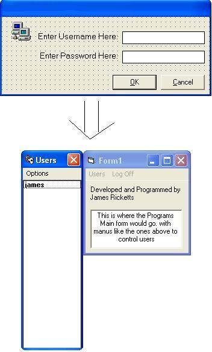



## Encrypted Login Dialog \(For use with Any Program\)

### Description

It is a sample Login Dialog which users can place into their applications easily to allow them to have multiple user accounts using their program. All passwords and usernames are Encrypted. You can view all user accounts and alter each username at runtime.

This is part of a larger program I am working on to Manage Network computers based around the Winsock Control which i will be posting sometime soon.
 
### More Info
 
To reset all passwords, instead of doing so from inside the application at runtime (if you forget the password and are unable to get into the application), you can just DELETE the LOGIN.dat file that is created when the program first runs. This will allow you to start a new userlist.

The code at the moment can support upto 20 users. However I am planning on changing it to be able to handle any number of users. This can be accomplished by simply changing the size of a few arrays! I just havent had time recently.

             |
---                |---
**Submitted On**   |2003-01-07 19:09:02
**By**             |[James Ricketts](https://github.com/Planet-Source-Code/PSCIndex/blob/master/ByAuthor/james-ricketts.md)
**Level**          |Beginner
**User Rating**    |5.0 (10 globes from 2 users)
**Compatibility**  |VB 6\.0
**Category**       |[Encryption](https://github.com/Planet-Source-Code/PSCIndex/blob/master/ByCategory/encryption__1-48.md)
**World**          |[Visual Basic](https://github.com/Planet-Source-Code/PSCIndex/blob/master/ByWorld/visual-basic.md)
**Archive File**   |[Encrypted\_152561172003\.zip](https://github.com/Planet-Source-Code/james-ricketts-encrypted-login-dialog-for-use-with-any-program__1-42255/archive/master.zip)

